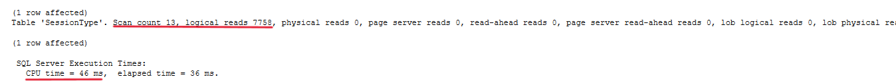
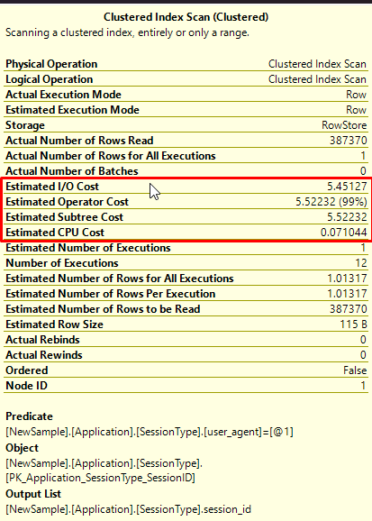
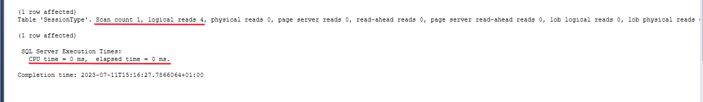
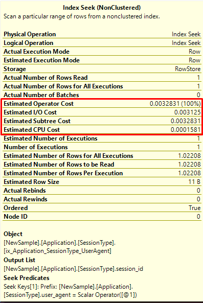

# Database Tuning Details

Querying the Application.SessionType to find a specific `user_agent` would have the following `STATISTICS IO` and `Query Plan`:

By adding non-clustered indexes from `Index Optimization/nonClusteredOLTP.sql`, we will reduce the resource overhead as it follows:

